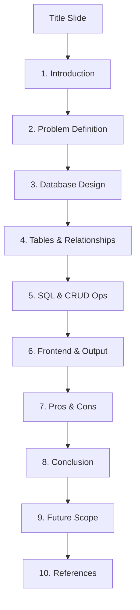
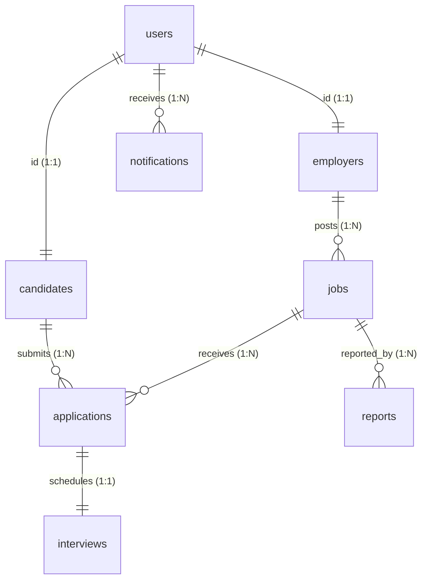

# 🌌 HireSphere.ai — PowerPoint Presentation Slide Deck Content

This document provides a slide-by-slide layout and high-impact speaker notes tailored specifically for your **HireSphere.ai** presentation. The content is formatted to be directly copied into your PowerPoint slides.

---

## 🛠️ Slide Deck Structure & Blueprint



---

## 🏷️ Title Slide
* **Slide Title:** **HireSphere.ai**
* **Subtitle:** Next-Gen AI Talent Acquisition & Verification System
* **Visual Layout:** Premium dark background with purple-to-cyan glow accents. Left-aligned bold text, right-aligned geometric dashboard schematic.
* **Key Bullet Points:**
  - Artificial Intelligence + Relational Integrity
  - Automated Resume Analysis & Skill Verification
  - Role-Based Protected Workspaces (Candidate, Employer, Admin)

---

## 📊 Section 1: Introduction

### Slide 1.1: What is HireSphere.ai?
* **Visual Layout:** Grid structure with 3 icon-anchored pillars.
* **Content:**
  * **Core Concept:** A premium, high-fidelity AI-powered talent acquisition platform designed for modern tech ecosystems.
  * **Intelligent Layer:** Fuses heuristic fraud monitoring with multi-factor candidate scoring.
  * **Cyberpunk Aesthetics:** Engineered using a sleek, professional dark cyberpunk HSL design system.

### Slide 1.2: Technical Architecture Stack
* **Visual Layout:** Horizontal split layout showing Client and Database layers.
* **Content:**
  * **Frontend Framework:** Next.js 15 (App Router, TSX Client Components, Tailwind CSS, Lucide icons).
  * **Animation & Motion:** Framer Motion for smooth modal glow-transforms and dynamic vertical timelines.
  * **Database Layer:** Supabase-compatible PostgreSQL with strict Row Level Security (RLS), custom audit triggers, and optimization indexes.
  * **AI & Telemetry:** Recharts for pipeline distributions and speech recognition tools for mock voice interviews.

---

## ⚠️ Section 2: Problem Definition

### Slide 2.1: The Pitfalls of Traditional Recruitment
* **Visual Layout:** Red-highlighted warning cards side-by-side.
* **Content:**
  * **Resume Overwhelm:** Recruiters spend average of 6 seconds per resume; manual parsing is highly error-prone and biased.
  * **ATS Gaming:** Traditional keyword-matching ATS engines are easily cheated by text-stuffed resumes.
  * **Lack of Real-time Screening:** Lack of voice-based, automated coding or verbal evaluation tools prior to face-to-face loops.

### Slide 2.2: The Security & Fraud Threat
* **Visual Layout:** Security shield graphic in warning orange color.
* **Content:**
  * **Fake Job Postings:** Phishing scams disguised as high-paying remote roles stealing candidates' wallet seeds or credentials.
  * **Credential Forgery:** Candidates inflating experience or stating technologies they have never used.
  * **Insecure Databases:** Traditional systems storing candidate profiles, transcripts, and salaries in unencrypted, unshielded tables.

---

## 📐 Section 3: Database Design

### Slide 3.1: Relational Entity Relationship (ER) Model
* **Visual Layout:** Mermaid diagram centered on the slide showing key relationships.
* **Mermaid Code (Copy into presentation if supporting interactive markdown, or use to draft visual):**


### Slide 3.2: Database Design Principles
* **Visual Layout:** Left column: Design rules; Right column: Database settings panel image.
* **Content:**
  * **Strict Type Safety:** Custom ENUM types (`user_role`, `application_status`, `interview_status`) prevent illegal state transitions.
  * **Normalization Constraints:** Multi-table relational design eliminating redundant applicant or job details.
  * **Automatic Cascading Rules:** Strict `ON DELETE CASCADE` mappings preserve data integrity when users or jobs are deleted.
  * **Atomic Transactions:** Structured to prevent double applications to identical jobs via unique key constraints `UNIQUE (candidate_id, job_id)`.

---

## 🗂️ Section 4: Tables and Relationships

### Slide 4.1: Core Users & Profiles
* **Visual Layout:** Two tables side-by-side showing schema metadata.
* **Content:**
  * **Table: `users` (Core Credentials)**
    - `id`: UUID (Primary Key, default uuid_generate_v4())
    - `email`: VARCHAR(255) (Unique, Not Null)
    - `role`: user_role (ENUM: 'candidate', 'employer', 'admin')
    - `banned`: BOOLEAN (Default FALSE)
    - *Constraint:* `email_length` (CHECK char_length(email) >= 5)
  * **Table: `candidates` (Candidate Profiles)**
    - `id`: UUID (Primary Key, REFERENCES users.id ON DELETE CASCADE)
    - `experience_years`: INTEGER (Default 0, CHECK >= 0)
    - `ats_score`: INTEGER (CHECK 0 to 100)

### Slide 4.2: Enterprise Postings & Applications
* **Visual Layout:** Detailed schema representation with lines highlighting relationships.
* **Content:**
  * **Table: `employers` (Company Info)**
    - `id`: UUID (PK, REFERENCES users.id ON DELETE CASCADE)
    - `company_name`: VARCHAR(150), `verified`: BOOLEAN
  * **Table: `jobs` (Open Job Postings)**
    - `id`: UUID (PK), `company_id`: UUID (FK REFERENCES employers.id)
    - `is_fake`: BOOLEAN (Default FALSE - used by AI Fraud Shield)
  * **Table: `applications` (Submissions & AI Metrics)**
    - `id`: UUID (PK), `candidate_id` (FK), `job_id` (FK)
    - `match_score` / `resume_quality` / `skill_match` (INTEGERS)

### Slide 4.3: Skills, Saved Jobs, Interviews & Reports
* **Visual Layout:** 4-quadrant layout with table details.
* **Content:**
  * **Table: `skills` & Junctions:** Many-to-Many via `candidate_skills` & `job_skills` tables.
  * **Table: `saved_jobs`:** Candidate bookmarks mapping candidate IDs to job IDs.
  * **Table: `interviews`:** Connects applications to physical meetups. Features scheduler links and scheduled times.
  * **Table: `reports` (Moderation Flags):** Connects users flagging jobs. Matches `reporter_id` and `job_id`.
  * **Table: `system_activity_logs`:** Audit trail capturing `user_email`, `action`, `details`, and `timestamp`.

---

## 💻 Section 5: SQL Queries / CRUD Operations

### Slide 5.1: Real-world Database Operations
* **Visual Layout:** Slide divided into raw query vs execution intent.
* **Content:**
  * **Job Creation Operation:**
    ```sql
    INSERT INTO jobs (company_id, title, description, salary, deadline, experience, location, remote)
    VALUES ('techcorp-uuid', 'Lead React Architect', 'Manage design pipelines...', '$150k-$180k', '2026-06-30', '5+ years', 'Austin, TX', TRUE);
    ```
  * **Employer Verification Toggle (Admin Action):**
    ```sql
    UPDATE employers SET verified = TRUE WHERE id = 'employer-uuid';
    ```
  * **Flagging Fraudulent Scam Postings:**
    ```sql
    UPDATE jobs SET is_fake = TRUE WHERE id = 'flagged-job-uuid';
    ```

### Slide 5.2: Complex View for Recruiter Metrics
* **Visual Layout:** Query highlighted in terminal-style code window.
* **Content:**
  - **SQL View: `employer_analytics_summary`**
  ```sql
  CREATE VIEW employer_analytics_summary AS
  SELECT 
      e.id AS employer_id, e.company_name,
      COUNT(DISTINCT j.id) AS total_jobs_posted,
      COALESCE(SUM(j.views), 0) AS total_job_views,
      COUNT(DISTINCT a.id) AS total_applications_received,
      ROUND((COUNT(DISTINCT CASE WHEN a.status = 'Hired' THEN a.id END)::DECIMAL / 
             NULLIF(COUNT(DISTINCT a.id), 0)) * 100, 2) AS hiring_rate_percentage
  FROM employers e
  LEFT JOIN jobs j ON e.id = j.company_id
  LEFT JOIN applications a ON j.id = a.job_id
  GROUP BY e.id, e.company_name;
  ```

### Slide 5.3: Security row-level guards (RLS) & Trigger Logs
* **Visual Layout:** Dual code blocks (RLS Policy + Audit Trigger).
* **Content:**
  * **Row-Level Security Policy for Candidate Privacy:**
    ```sql
    -- Candidates can only read or manage their own profiles
    CREATE POLICY candidates_self_manage ON candidates 
    FOR ALL USING (auth.uid() = id);
    ```
  * **System Audit Trail Trigger Function:**
    ```sql
    CREATE OR REPLACE FUNCTION log_ecosystem_activity()
    RETURNS TRIGGER AS $$
    BEGIN
        INSERT INTO system_activity_logs (user_email, action, details)
        VALUES ('system_trigger@hiresphere.ai', TG_TABLE_NAME || '_CREATED', 'New record with ID: ' || NEW.id::text);
        RETURN NULL;
    END; $$ LANGUAGE plpgsql;
    ```

---

## 🎨 Section 6: Frontend and Output

### Slide 6.1: The HSL Cyberpunk Design System
* **Visual Layout:** Beautiful slide showing dark layout swatches (colors, buttons, typography).
* **Content:**
  * **Theme Palette:** Built on HSL CSS variables (`--background: 240 10% 3.9%`, `--accent: 180 100% 50%`) representing a deep space/neon UI.
  * **Fluid Micro-Animations:** Framer Motion animating grid expansions, hover scale factors (1.05x), and page transitions.
  * **Glassmorphism:** Backdrops designed with absolute border-glowing gradients (`backdrop-blur-2xl`, `bg-black/60`).

### Slide 6.2: Core Portals & Dynamic Telemetry
* **Visual Layout:** Three portal columns matching roles, with mockups.
* **Content:**
  * **Candidate Portal:** Direct resume parsing, personalized AI Career Roadmaps (vertical timelines), and Voice Mock Interview Simulator featuring a 15-bar glowing real-time soundwave element.
  * **Employer Portal:** Candidate applicants pipeline, automated match scores, and an Interactive Global SVG Heatmap charting regional hub densities with tooltips.
  * **Admin Portal:** Moderation queue displaying flagged phishing jobs, a fraud detection review panel, and live activity log audit streams.

---

## ⚖️ Section 7: Advantages and Limitations

### Slide 7.1: Strengths vs Constraints
* **Visual Layout:** Left column: Advantages (Green ticks); Right column: Limitations (Yellow warning icons).
* **Content:**
  * **Advantages (Strengths):**
    - **Multi-Factor Recommendation:** Weights Skills (30%), Experience (25%), Education (15%), ATS (15%), and Culture Fit (15%).
    - **Heuristic Fraud Shield:** Automated checks on anomalous salary-to-experience ratios and phishing keyphrases in listings.
    - **High-Fidelity Security:** Rigorous Row Level Security preventing profile breaches.
  * **Limitations (Constraints):**
    - **Client-Side Sandbox Mode:** Active data resides in local storage; production database syncs require external Supabase connection hooks.
    - **API Dependencies:** Simulated voice and speech recognition require high-speed internet networks to prevent latency.

---

## 🏁 Section 8: Conclusion

### Slide 8.1: Executive Summary
* **Visual Layout:** Bold statement centered on slide, flanked by brief paragraphs.
* **Content:**
  - **Unified Ecosystem:** HireSphere.ai successfully demonstrates that modern talent acquisition can be secure, beautiful, and intelligent.
  - **Relational Stability:** Highly normalized tables prevent data duplication while triggers audit every key action.
  - **Next-Gen UX:** The cyberpunk design system and dynamic micro-animations redefine the boring corporate recruitment process.

---

## 🚀 Section 9: Future Scope

### Slide 9.1: The Next Horizon
* **Visual Layout:** Future roadmap timeline moving left-to-right.
* **Content:**
  * **Decentralized Verifications:** Mappings to zero-knowledge cryptographic protocol nodes to verify candidate background claims securely.
  * **On-device AI Agents:** Deploying smaller, fast WebAssembly LLM models directly inside the browser for zero-latency, offline mock interviews.
  * **Real-time Map Telemetry:** Replacing static SVG global heatmaps with dynamic Leaflet or Mapbox APIs for interactive geolocation telemetry.
  * **Automated Sandbox Environments:** Coding evaluation workspaces assessing real developer inputs inside secure Docker terminals.

---

## 📚 Section 10: References

### Slide 10.1: Citations & Standards
* **Visual Layout:** Elegant bibliography-style lists.
* **Content:**
  1. **Next.js 15 Documentation** — React Server Components & App Router layouts (Vercel, 2025).
  2. **PostgreSQL RLS Architecture Guidelines** — Row-Level Security policies & performance tuning (PostgreSQL Core Team).
  3. **Framer Motion API Reference** — Fluid UI physics & spring transitions.
  4. **Supabase Relational Database Migrations** — Cloud triggers, views, and data sync models.
  5. **Lucide Icons & Recharts Framework** — Scalable vector components & telemetry graphs.
